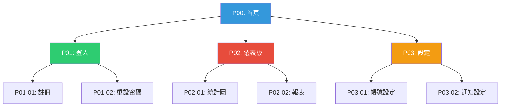

# Design Deliverables SOP

## Reference Protocol

**Full SOP**: [ai-design-workflow v1.3 - Section 1.3.6](../../../protocols/ai-design-workflow_2026-02-13_v1.3.md#136-️-design-deliverables-sop--設計展示標準作業程序)

---

## Applicability

Applies to: **All design agents** in web-design-team

- `design-director`
- `ux-designer`
- `ui-designer`
- `project-coordinator` (for delivery oversight)

---

## Mandatory Deliverables

When designing websites/systems, you **MUST** provide:

### 1️⃣ Sitemap (SVG or Mermaid, Hierarchical Tree Structure)

**Format Selection / 格式選擇**:

**Design Director decides based on complexity:**

| Complexity | Pages | Levels | Recommended Format | Reason |
|-----------|-------|--------|-------------------|--------|
| **Simple** | < 10 | 1-2 | ✅ **Mermaid** | Faster to create, easy to maintain, auto-layout |
| **Medium** | 10-20 | 2-3 | ⚠️ **Mermaid or SVG** | Design Director decides based on layout complexity |
| **Complex** | > 20 | 3+ | ✅ **SVG** | Full control, custom positioning, better for dense layouts |

**Mermaid Benefits**:
- ✅ Faster to write (text-based)
- ✅ Easy to modify
- ✅ Auto-layout (no manual positioning)
- ✅ Embedded in HTML with `<script>` tag
- ❌ Limited layout control for complex structures

**SVG Benefits**:
- ✅ Full control over positioning
- ✅ Better for dense/complex layouts (> 20 pages)
- ✅ Can handle custom grouping boxes
- ✅ Embedded directly in HTML
- ❌ Slower to create (manual coordinates)

**Decision Criteria**:
1. **Page count**: < 10 pages → Mermaid, > 20 pages → SVG
2. **Layout complexity**: Many groupings → SVG, Simple tree → Mermaid
3. **Maintenance**: Frequent changes → Mermaid, Stable structure → SVG

---

**Structure Requirement / 結構要求**:
- ✅ **階層式樹狀結構**（Hierarchical Tree Structure）
  - 像組織圖（org chart）或檔案目錄樹
  - 清楚的父子層級關係
  - 根節點（首頁）在最上方
  - 各層級依序展開向下
  - NOT: 左右展開、放射狀、網狀結構

**Technical Requirements / 技術要求**:

**If using SVG**:
- ✅ **SVG must be embedded in HTML** (NOT external file)
  - Use `<svg>...</svg>` directly in HTML
  - NOT ``
  - Reason: Easy to print as PDF
- ✅ Follow SVG drawing order (lines → nodes → text)
- ✅ Use `<g>` groups for organization

**If using Mermaid**:
- ✅ **Mermaid must be embedded in HTML** with script tag
  - Use `<div class="mermaid">graph TD ...</div>`
  - Include Mermaid CDN: `<script src="https://cdn.jsdelivr.net/npm/mermaid/dist/mermaid.min.js"></script>`
  - Reason: Easy to render and print as PDF

**Common Requirements (Both formats)**:
- ✅ **Fixed A4 size** (210mm x 297mm)
- ✅ **NOT screen responsive** - only print responsive (A4 Paper)
- ✅ Include page codes (P00, P01, P02...)

**Hierarchical Tree Structure Example / 階層式樹狀結構範例**:

```
                    P00: 首頁
                       │
        ┌──────────────┼──────────────┐
        │              │              │
     P01: 登入      P02: 儀表板    P03: 設定
        │              │              │
    ┌───┴───┐      ┌───┴───┐      ┌───┴───┐
    │       │      │       │      │       │
P01-01: P01-02: P02-01: P02-02: P03-01: P03-02:
 註冊    重設   統計圖   報表    帳號    通知
        密碼                      設定    設定
```

**Visual Characteristics / 視覺特徵**:
- ✅ Root node (P00) at the top
- ✅ Child nodes below parent nodes
- ✅ Clear vertical hierarchy (Level 0 → Level 1 → Level 2)
- ✅ Branches spread horizontally at same level
- ✅ Connection lines show parent-child relationships
- ❌ NOT: Left-to-right flow
- ❌ NOT: Radial/circular layout (mind map style)
- ❌ NOT: Web/network structure (many-to-many connections)

---

**Mermaid Example / Mermaid 範例**:



**Embedded in HTML**:
```html
<script src="https://cdn.jsdelivr.net/npm/mermaid/dist/mermaid.min.js"></script>
<script>mermaid.initialize({ startOnLoad: true });</script>

<div class="mermaid">
graph TD
    P00[P00: 首頁] --> P01[P01: 登入]
    P00 --> P02[P02: 儀表板]
    ...
</div>
```

---

**SVG Drawing Order (Critical) / SVG 繪製順序（關鍵）**:

⚠️ **If using SVG, follow this drawing order to prevent lines from covering nodes:**

```xml
<svg xmlns="http://www.w3.org/2000/svg" width="210mm" height="297mm" viewBox="0 0 210 297">
  <!-- Layer 1: Background (optional) -->
  <rect class="background" fill="#f9f9f9" width="210" height="297"/>

  <!-- Layer 2: Connection Lines (DRAW FIRST) -->
  <g class="connections">
    <line x1="105" y1="35" x2="42.5" y2="50" stroke="#95a5a6" stroke-width="0.3"/>
    <line x1="105" y1="35" x2="107.5" y2="50" stroke="#95a5a6" stroke-width="0.3"/>
  </g>

  <!-- Layer 3: Nodes (DRAW SECOND - will be on top of lines) -->
  <g class="nodes">
    <rect x="85" y="20" width="40" height="15" fill="#3498db" stroke="#2c3e50" stroke-width="0.5"/>
    <rect x="25" y="50" width="35" height="12" fill="#ecf0f1" stroke="#34495e" stroke-width="0.4"/>
  </g>

  <!-- Layer 4: Text Labels (DRAW LAST - on top of everything) -->
  <g class="labels">
    <text x="105" y="29" text-anchor="middle" font-size="4" fill="white">P00: 首頁</text>
    <text x="42.5" y="57.5" text-anchor="middle" font-size="3.5" fill="#2c3e50">P01: 登入</text>
  </g>
</svg>
```

**Key Principles / 關鍵原則**:

1. **Drawing Order / 繪製順序**:
   - ✅ Lines FIRST (background layer)
   - ✅ Nodes SECOND (middle layer)
   - ✅ Text LAST (top layer)
   - ❌ DON'T: Draw nodes first, then lines (lines will cover nodes)

2. **Use `<g>` Groups / 使用群組標籤**:
   - `<g class="connections">` for all lines
   - `<g class="nodes">` for all boxes/circles
   - `<g class="labels">` for all text
   - Reason: Easy to maintain and modify

3. **Line Styling / 連接線樣式**:
   - ✅ Thin stroke (0.3-0.5mm)
   - ✅ Light color (#95a5a6, #bdc3c7)
   - ❌ DON'T: Thick lines (> 1mm)
   - ❌ DON'T: Dark lines that compete with nodes

4. **Node Styling / 節點樣式**:
   - ✅ Solid fill (NOT transparent)
   - ✅ Stroke for border definition
   - ✅ Sufficient padding for text
   - ❌ DON'T: Transparent background (lines will show through)

5. **Text Styling / 文字樣式**:
   - ✅ Contrasting color (white on dark nodes, dark on light nodes)
   - ✅ Appropriate font size (3.5-4mm for page codes)
   - ✅ text-anchor="middle" for centering
   - ❌ DON'T: Poor contrast (hard to read)

6. **Structure vs Decoration / 結構 vs 裝飾原則**:

   **⚠️ Critical Distinction: What is a Tree Node?**

   **Structural Nodes (真正的節點)**:
   - ✅ Page codes that represent actual pages (P00, P01, P02, P03-01...)
   - ✅ These define the hierarchical tree structure
   - ✅ Each has parent-child relationships
   - ✅ Connected by lines showing navigation flow

   **Decorative Elements (裝飾性元素)**:
   - ⚠️ Visual grouping boxes (e.g., "成員管理", "專案管理")
   - ⚠️ Category labels without page codes
   - ⚠️ Background rectangles for visual organization
   - ⚠️ These are NOT tree nodes - they are decoration

   **Common Mistake / 常見錯誤**:
   ```
   ❌ WRONG: Treating grouping boxes as tree nodes

           [成員管理]                    [專案管理]
              │                            │
      ┌───────┼───────┐              ┌────┴────┐
   P01: 新增 P02: 編輯 P03: 刪除   P04: 建立 P05: 結案
   ```
   **Problem**: "成員管理" and "專案管理" are NOT nodes - they are just visual labels!

   **Correct Approach / 正確做法**:
   ```
   ✅ CORRECT: Only page codes are nodes

                        P00: 首頁
                           │
               ┌───────────┼───────────┐
               │                       │
   ┌───────────┴──────────┐   ┌───────┴────────┐
   │                      │   │                │
   │   [成員管理]          │   │  [專案管理]     │  ← Decorative grouping
   │                      │   │                │
   │  P01:新增 P02:編輯   │   │ P03:建立 P04:結案│  ← These are the nodes
   └──────────────────────┘   └─────────────────┘
   ```

   **Design Process / 設計步驟**:
   1. **First**: Design tree structure with page codes (P00, P01, P02...)
   2. **Second**: Draw connection lines showing hierarchy
   3. **Third**: Add decorative grouping boxes if needed
   4. **Never**: Start with grouping boxes and treat them as nodes

   **Verification Checklist / 檢查清單**:
   - [ ] Every tree node has a page code (P##, P##-##)
   - [ ] Grouping boxes are clearly decorative (dashed borders, light colors)
   - [ ] Connection lines only connect page codes, not grouping boxes
   - [ ] Grouping boxes do NOT have parent-child relationships

   **SVG Implementation / SVG 實作**:
   ```xml
   <svg>
     <!-- Decorative grouping box (drawn FIRST, background layer) -->
     <rect class="decorative-group"
           x="10" y="40" width="60" height="50"
           fill="none" stroke="#e0e0e0" stroke-width="0.2" stroke-dasharray="1,1"/>
     <text class="group-label" x="40" y="35" fill="#999" font-size="3">成員管理</text>

     <!-- Connection lines (drawn SECOND) -->
     <g class="connections">
       <line x1="40" y1="20" x2="25" y2="50"/>
       <line x1="40" y1="20" x2="55" y2="50"/>
     </g>

     <!-- Tree nodes with page codes (drawn THIRD - on top) -->
     <g class="nodes">
       <rect x="20" y="10" width="40" height="15" fill="#3498db"/>  <!-- P00 -->
       <rect x="10" y="50" width="30" height="12" fill="#ecf0f1"/>  <!-- P01 -->
       <rect x="45" y="50" width="30" height="12" fill="#ecf0f1"/>  <!-- P02 -->
     </g>

     <!-- Text labels (drawn LAST) -->
     <g class="labels">
       <text x="40" y="19">P00: 首頁</text>
       <text x="25" y="57">P01: 新增</text>
       <text x="60" y="57">P02: 編輯</text>
     </g>
   </svg>
   ```

---

### 2️⃣ Page Numbering System
- ✅ Each page has unique code (P##)
- ✅ Sub-pages: P##-## format
- ✅ Start from P00 (homepage)
- ✅ Sequential by user flow priority

### 3️⃣ Wireframes with Clickable Page Codes
- ✅ File naming: `P##_page-name_wireframe_YYYY-MM-DD_v1.0.html`
- ✅ Clicking page code in sitemap → jumps to wireframe
- ✅ Each wireframe shows page purpose and features
- ✅ Status indicator (Ready/WIP/Review)

### 4️⃣ Four Delivery Formats

| Format | Purpose | Required |
|--------|---------|----------|
| 📊 **Interactive HTML** | Browser-viewable, sitemap + page cards + feature checklist | ✅ Mandatory |
| 📄 **PDF/PPTX** | A4 print-friendly for client markup | ✅ Mandatory |
| 🔀 **Mermaid Flow** | Page flow visualization | ⚠️ Ask client first |
| 📋 **Excel Checklist** | Feature tracking with priority & feedback | ⚠️ Ask client first |

---

## Fixed A4 Size Principle

**Design deliverables for client confirmation use FIXED A4 size**

**RWD Definition for Design Deliverables**:
- ❌ **NOT screen responsive** (no mobile/tablet/desktop breakpoints)
- ✅ **ONLY print responsive** (A4 Paper size for print)
- Fixed layout for screen viewing, optimized for print

**Why?**
- ✅ Consistent layout across all devices
- ✅ Print-friendly (easy to mark with pen)
- ✅ Professional presentation
- ✅ No layout shifts when viewing/printing
- ✅ SVG embedded for perfect PDF export

**CSS Requirement**:
```css
/* Fixed A4 size for screen */
body {
  width: 210mm;
  min-height: 297mm;
  margin: 0 auto;
  background: white;
}

/* Print optimization (A4 Paper RWD) */
@media print {
  @page {
    size: A4 portrait;
    margin: 1.5cm;
  }

  body {
    width: 210mm;
    margin: 0;
  }

  /* Ensure SVG prints correctly */
  svg {
    max-width: 100%;
    height: auto;
  }
}
```

---

## Client Confirmation Workflow

### Step 1: Ask Client Preference

Before generating all deliverables, ask:

```
「您希望以什麼格式確認設計？我們可以提供：

1. 📊 互動式 HTML（可在瀏覽器中查看，含功能勾選清單）
2. 📄 A4 PDF（可列印，方便用筆標記）
3. 🔀 Mermaid 流程圖（視覺化頁面流程）
4. 📋 Excel 功能表（含優先級與回饋欄）

建議：HTML + PDF，方便線上查看與離線標記。」
```

### Step 2: Generate Requested Formats

Based on client preference:
- **Minimum**: HTML + PDF
- **Recommended**: HTML + PDF + Mermaid + Excel
- **Full package**: All four formats

### Step 3: Deliver with Clear Naming

```
{project-name}_design-overview_{YYYY-MM-DD}_v1.0.html
{project-name}_design-overview_{YYYY-MM-DD}_v1.0.pdf
{project-name}_page-flow_{YYYY-MM-DD}_v1.0.md
{project-name}_feature-checklist_{YYYY-MM-DD}_v1.0.xlsx
```

---

## Deliverables Checklist

Before delivering to client, ensure:

**Mandatory**:
- [ ] **Design Director decided Sitemap format** (SVG or Mermaid, based on complexity)
- [ ] **Sitemap embedded in HTML** - Hierarchical tree, fixed A4, with page codes
- [ ] Page Numbering - All pages have P## codes
- [ ] Wireframes - Each page has detailed HTML
- [ ] Interactive HTML - Complete with sitemap + cards + checklist
- [ ] PDF Export - Generated from HTML, A4 size (print-optimized)
- [ ] Client asked for format preference (HTML/PDF/Mermaid/Excel)
- [ ] If using SVG: Follow drawing order (lines → nodes → text)
- [ ] If using Mermaid: Include CDN script and initialize

**Optional** (if client requested):
- [ ] Mermaid Flow Diagram
- [ ] Excel Feature Checklist

---

## File Structure Example

```
project-name/
├── design-overview/
│   ├── {project}_design-overview_{date}_v1.0.html  ← Interactive
│   ├── {project}_design-overview_{date}_v1.0.pdf   ← PDF
│   ├── {project}_page-flow_{date}_v1.0.md          ← Mermaid
│   └── {project}_feature-checklist_{date}_v1.0.xlsx ← Excel
└── wireframes/
    ├── P00_homepage_wireframe_{date}_v1.0.html
    ├── P01_login-page_wireframe_{date}_v1.0.html
    └── P02_dashboard_wireframe_{date}_v1.0.html
```

---

## Violation Determination

### Critical Violations

- ❌ Delivered wireframes without sitemap
- ❌ No page numbering system (P## codes)
- ❌ Used screen responsive design (mobile/tablet breakpoints) for client confirmation deliverables
- ❌ Delivered without asking client format preference
- ❌ Sitemap not embedded in HTML (whether SVG or Mermaid, must be embedded, NOT external file)

### Major Violations

- ⚠️ **Sitemap not hierarchical tree structure** (using left-to-right flow, radial layout, or web structure)
- ⚠️ **Treating decorative grouping boxes as tree nodes** (grouping boxes should be decoration only, NOT nodes with parent-child relationships)
- ⚠️ **Design Director did not decide format** (should choose SVG or Mermaid based on complexity)
- ⚠️ Sitemap not fixed A4 size
- ⚠️ Missing feature checklist in HTML deliverable
- ⚠️ Inconsistent page code naming
- ⚠️ Missing print optimization CSS (@media print)
- ⚠️ **If using SVG: Drawing order incorrect** (nodes drawn before lines, causing lines to cover nodes)
- ⚠️ **If using SVG: Missing `<g>` groups** for organizing SVG layers (connections, nodes, labels)

### Minor Violations

- ⚡ Poor file naming convention
- ⚡ Missing status indicators on wireframes

---

## Templates & Examples

All templates, CSS, and complete examples are available in:

**Full Protocol**: `protocols/ai-design-workflow_2026-02-13_v1.3.md` - Section 1.3.6

Includes:
- Complete HTML template (Interactive HTML)
- SVG sitemap example
- Mermaid flow diagram template
- Excel checklist structure
- CSS for fixed A4 size

---

## Quick Reference

**Remember**:
- 📐 **Fixed A4 size** (NOT screen responsive, ONLY print responsive)
- 🔢 **Page codes** (P00, P01, P02...)
- 📊 **Four formats** (HTML, PDF, Mermaid, Excel)
- 🙋 **Ask client first** before generating all formats
- 🔝 **Sitemap is top-down**, not left-to-right
- 🎨 **SVG must be embedded** in HTML (NOT external file)
- 🖨️ **Print optimization** with @media print CSS

---

**This rule ensures consistent, professional, and client-friendly design deliverables.**

**Version**: 1.5
**Created**: 2026-02-15
**Updated**: 2026-02-16
**Based on**: ai-design-workflow v1.3 - Section 1.3.6

**Changelog**:
- v1.5 (2026-02-16): **Added Sitemap format flexibility** - Design Director can choose SVG or Mermaid based on complexity (< 10 pages → Mermaid, > 20 pages → SVG); added Mermaid example and embedded code; updated violation criteria to reflect conditional SVG rules
- v1.4 (2026-02-16): Added "Structure vs Decoration" principle - clarified what is a tree node vs decorative element, common mistakes, correct approach, verification checklist, SVG implementation example; updated violation criteria
- v1.3 (2026-02-15): Clarified sitemap structure requirement: hierarchical tree structure (NOT abstract "top-down"), added visual example, updated violation criteria
- v1.2 (2026-02-15): Added SVG drawing order principles (lines → nodes → text), layer organization with `<g>` groups, styling guidelines for lines/nodes/text
- v1.1 (2026-02-15): Added SVG embedded requirement, clarified print-only RWD, added print optimization CSS
- v1.0 (2026-02-15): Initial version
