# 🗺️ Mido Learning - 网站地图 (Sitemap)

> **生成日期**: 2026-02-17
> **版本**: 1.0
> **目的**: 完整的网站结构导览图

---

## 📊 网站结构总览

```mermaid
graph TB
    Home[首页 /]

    %% Public Routes
    Home --> Public[公开区域]
    Public --> About[关于技能村庄]
    Public --> Categories[分类浏览]
    Public --> Materials[教材详情]
    Public --> Games[游戏入口]
    Public --> Courses[课程]

    %% Auth Routes
    Home --> Auth[认证区域]
    Auth --> Login[登录]
    Auth --> Register[注册]
    Auth --> SVLogin[技能村庄登录]

    %% Member Routes
    Home --> Member[会员区域 🔒]
    Member --> Dashboard[仪表板]
    Member --> Profile[个人资料]
    Member --> Components[我的元件]
    Member --> SkillVillage[技能村庄]
    Member --> Character[角色管理]

    %% Teacher Routes
    Home --> Teacher[教师区域 🔒👨‍🏫]
    Teacher --> TeacherComponents[元件管理]
    Teacher --> Upload[上传教材]
    Teacher --> TeacherProfile[教师资料]
    Teacher --> Taxonomy[分类管理]
    Teacher --> Wishes[愿望清单]

    %% Admin Routes
    Home --> Admin[管理员区域 🔒👑]
    Admin --> AdminDashboard[管理仪表板]
    Admin --> Users[用户管理]
    Admin --> AdminComponents[元件管理]
    Admin --> Costs[成本管理]
    Admin --> AdminWishes[愿望统计]

    %% Game Admin Routes
    Home --> GameAdmin[游戏管理员 🔒🎮]
    GameAdmin --> GameDashboard[游戏仪表板]
    GameAdmin --> Achievements[成就管理]

    %% Fullscreen
    Home --> Fullscreen[全屏查看器]

    style Home fill:#4CAF50,stroke:#2E7D32,color:#fff
    style Public fill:#2196F3,stroke:#1565C0,color:#fff
    style Auth fill:#FF9800,stroke:#E65100,color:#fff
    style Member fill:#9C27B0,stroke:#6A1B9A,color:#fff
    style Teacher fill:#F44336,stroke:#C62828,color:#fff
    style Admin fill:#E91E63,stroke:#880E4F,color:#fff
    style GameAdmin fill:#3F51B5,stroke:#1A237E,color:#fff
    style Fullscreen fill:#607D8B,stroke:#37474F,color:#fff
```



---

## 📑 完整页面列表

### 1️⃣ 公开区域 (Public) - 无需登录

| 路径 | 页面名称 | 说明 | 动态参数 |
|------|---------|------|---------|
| `/` | 首页 | 网站首页，展示精选内容 | - |
| `/about-skill-village` | 关于技能村庄 | 技能村庄游戏介绍 | - |
| `/categories` | 分类列表 | 浏览所有学习分类 | - |
| `/categories/[category]` | 分类详情 | 查看特定分类的内容 | `category` |
| `/materials/[componentId]` | 教材详情 | 查看学习教材详情 | `componentId` |
| `/games` | 游戏入口 | 游戏相关内容 | - |
| `/courses/[id]` | 课程详情 | 课程详细信息 | `id` |
| `/courses/[id]/play` | 课程播放 | 播放/学习课程 | `id` |

**访问权限**: ✅ 所有人（包括未登录用户）

---

### 2️⃣ 认证区域 (Auth) - 登录/注册

| 路径 | 页面名称 | 说明 | 特殊行为 |
|------|---------|------|---------|
| `/login` | 登录页面 | 用户登录 | 已登录则重定向到 dashboard |
| `/register` | 注册页面 | 用户注册 | 已登录则重定向到 dashboard |
| `/register/simple` | 简易注册 | 简化版注册流程 | 已登录则重定向到 dashboard |
| `/skill-village-login` | 技能村庄登录 | 游戏专用登录页面 | 已登录则重定向到 skill-village |

**访问权限**: ✅ 未登录用户（已登录会被重定向）

---

### 3️⃣ 会员区域 (Member) - 需要登录 🔒

| 路径 | 页面名称 | 说明 | 动态参数 |
|------|---------|------|---------|
| `/dashboard` | 会员仪表板 | 个人学习总览 | - |
| `/dashboard/achievements` | 成就列表 | 查看已获得的成就 | - |
| `/profile` | 个人资料 | 编辑个人信息 | - |
| `/components` | 我的元件 | 查看已学习/收藏的元件 | - |
| `/components/[componentId]` | 元件详情 | 查看元件详细内容 | `componentId` |
| `/components/[componentId]/materials/[materialId]` | 教材查看 | 查看元件的教材内容 | `componentId`, `materialId` |
| `/skill-village` | 技能村庄 | 技能村庄游戏主页 | - |
| `/skill-village/[skillId]` | 技能详情 | 查看特定技能详情 | `skillId` |
| `/character` | 角色管理 | 管理游戏角色 | - |
| `/characters` | 角色列表 | 查看所有角色 | - |

**访问权限**: 🔒 需要登录
**重定向**: 未登录用户会被重定向到 `/login`

---

### 4️⃣ 教师区域 (Teacher) - 需要教师权限 🔒👨‍🏫

| 路径 | 页面名称 | 说明 | 动态参数 |
|------|---------|------|---------|
| `/teacher/components` | 元件管理 | 管理我的教学元件 | - |
| `/teacher/components/upload` | 上传元件 | 上传新的教学元件 | - |
| `/teacher/components/[id]/edit` | 编辑元件 | 编辑现有元件 | `id` |
| `/teacher/profile` | 教师资料 | 教师个人资料 | - |
| `/teacher/taxonomy` | 分类管理 | 管理教学分类 | - |
| `/teacher/wishes` | 学生愿望 | 查看学生的学习愿望 | - |

**访问权限**: 🔒👨‍🏫 需要登录 + 教师角色
**重定向**: 非教师用户会被拒绝访问

---

### 5️⃣ 管理员区域 (Admin) - 需要管理员权限 🔒👑

| 路径 | 页面名称 | 说明 | 动态参数 |
|------|---------|------|---------|
| `/admin` | 管理仪表板 | 系统管理总览 | - |
| `/admin/users` | 用户管理 | 管理所有用户 | - |
| `/admin/components` | 元件管理 | 管理所有元件 | - |
| `/admin/costs` | 成本管理 | 查看/管理系统成本 | - |
| `/admin/wishes` | 愿望管理 | 管理用户愿望 | - |
| `/admin/wishes/stats` | 愿望统计 | 愿望数据统计分析 | - |

**访问权限**: 🔒👑 需要登录 + 管理员角色
**重定向**: 非管理员用户会被拒绝访问

---

### 6️⃣ 游戏管理员区域 (Game Admin) - 需要管理员权限 🔒🎮

| 路径 | 页面名称 | 说明 | 动态参数 |
|------|---------|------|---------|
| `/game-admin` | 游戏仪表板 | 游戏系统管理总览 | - |
| `/game-admin/achievements` | 成就管理 | 管理所有成就 | - |
| `/game-admin/achievements/new` | 新建成就 | 创建新成就 | - |
| `/game-admin/achievements/[id]/edit` | 编辑成就 | 编辑现有成就 | `id` |

**访问权限**: 🔒👑 需要登录 + 管理员角色
**重定向**: 非管理员用户会被拒绝访问

---

### 7️⃣ 全屏查看器 (Fullscreen) - 动态权限

| 路径 | 页面名称 | 说明 | 动态参数 | 访问权限 |
|------|---------|------|---------|---------|
| `/materials/[componentId]/fullscreen` | 教材全屏查看 | iframe 全屏显示教材 | `componentId` | 依元件可见性设定 |

**访问权限**: 🔄 动态（依元件设定）
- `published`: ✅ 所有人
- `login`: 🔒 需要登录
- `private`: 🔒👑 仅拥有者或管理员

---

## 🎯 按功能分组

### 学习相关
- 首页 `/`
- 分类浏览 `/categories`, `/categories/[category]`
- 教材查看 `/materials/[componentId]`
- 课程学习 `/courses/[id]`, `/courses/[id]/play`
- 我的元件 `/components`, `/components/[componentId]`

### 游戏相关 🎮
- 游戏入口 `/games`
- 技能村庄 `/skill-village`, `/skill-village/[skillId]`
- 角色管理 `/character`, `/characters`
- 成就系统 `/dashboard/achievements`

### 用户管理
- 登录/注册 `/login`, `/register`, `/register/simple`
- 个人资料 `/profile`
- 仪表板 `/dashboard`

### 教学管理 👨‍🏫
- 元件管理 `/teacher/components`, `/teacher/components/upload`, `/teacher/components/[id]/edit`
- 分类管理 `/teacher/taxonomy`
- 学生愿望 `/teacher/wishes`

### 系统管理 👑
- 用户管理 `/admin/users`
- 元件管理 `/admin/components`
- 成本管理 `/admin/costs`
- 愿望统计 `/admin/wishes`, `/admin/wishes/stats`
- 成就管理 `/game-admin/achievements`

---

## 🔐 权限层级

```
Level 0: Public (所有人)
    └─ /, /about-skill-village, /categories, /materials, /games, /courses

Level 1: Authenticated (已登录)
    └─ /dashboard, /profile, /components, /skill-village, /character

Level 2: Teacher (教师)
    └─ /teacher/* (包含 Level 1 所有权限)

Level 3: Admin (管理员)
    └─ /admin/*, /game-admin/* (包含 Level 1 & 2 所有权限)
```

---

## 📱 RWD 支持情况

| 路由组 | Desktop | Tablet | Mobile | 备注 |
|--------|---------|--------|--------|------|
| (public) | ✅ | ✅ | ✅ | 完整 RWD 支持 |
| (auth) | ✅ | ✅ | ✅ | 完整 RWD 支持 |
| (member) | ✅ | ✅ | ✅ | 完整 RWD 支持 |
| (teacher) | ✅ | ✅ | ⚠️ | 部分功能需桌面操作 |
| (admin) | ✅ | ⚠️ | ⚠️ | 建议桌面使用 |
| (game-admin) | ✅ | ⚠️ | ⚠️ | 建议桌面使用 |
| (fullscreen) | ✅ | ✅ | ✅ | 完整 RWD 支持 |

---

## 🚀 快速导航

### 我想要...

| 目标 | 路径 |
|------|------|
| 浏览学习内容 | `/` → `/categories` → `/materials/[componentId]` |
| 开始学习课程 | `/courses/[id]` → `/courses/[id]/play` |
| 玩技能村庄 | `/skill-village` |
| 上传教材 | `/teacher/components/upload` |
| 管理用户 | `/admin/users` |
| 创建成就 | `/game-admin/achievements/new` |
| 查看我的成就 | `/dashboard/achievements` |

---

## 📊 统计

| 类别 | 数量 |
|------|------|
| **总页面数** | 41 |
| 公开页面 | 8 |
| 认证页面 | 4 |
| 会员页面 | 10 |
| 教师页面 | 6 |
| 管理员页面 | 6 |
| 游戏管理员页面 | 4 |
| 全屏查看器 | 1 |
| 动态路由 | 12 |

---

## 🔄 路由命名规范

### 动态参数命名
- `[componentId]`: 学习元件 ID
- `[materialId]`: 教材 ID
- `[category]`: 分类 slug
- `[skillId]`: 技能 ID
- `[id]`: 通用 ID（课程、成就等）

### 路由组命名
- `(public)`: 公开访问
- `(auth)`: 认证相关
- `(member)`: 需要登录
- `(teacher)`: 需要教师权限
- `(admin)`: 需要管理员权限
- `(game-admin)`: 游戏管理员
- `(fullscreen)`: 全屏显示

---

## 📝 备注

1. **动态路由**: 使用 `[param]` 语法的路由需要提供对应参数
2. **权限检查**: 各路由组在 layout 层级实施权限检查
3. **重定向逻辑**:
   - 未登录访问受保护路由 → `/login`
   - 已登录访问认证页面 → `/dashboard`
   - 无权限访问特定路由 → 403 或重定向到首页
4. **全屏查看器**: 用于 iframe 显示教材，根据元件可见性动态控制访问

---

**文档维护**:
- 🔄 新增页面时更新此文档
- 🔄 路由变更时更新对应章节
- 🔄 权限调整时更新权限层级

**最后更新**: 2026-02-17
**维护者**: Claude Code
