# 🗺️ Mido Learning - 網站地圖 (Sitemap)

> **生成日期**: 2026-02-17
> **版本**: 2.0
> **目的**: 完整的網站結構導覽圖
> **語言**: 繁體中文

---

## 📊 網站結構總覽

```mermaid
graph TB
    Home[首頁 /]

    %% Public Routes
    Home --> Public[公開區域]
    Public --> About[關於技能村莊]
    Public --> Categories[分類瀏覽]
    Public --> Materials[教材詳情]
    Public --> Games[遊戲入口]
    Public --> Courses[課程]

    %% Auth Routes
    Home --> Auth[認證區域]
    Auth --> Login[登入]
    Auth --> Register[注冊]
    Auth --> SVLogin[技能村莊登入]

    %% Member Routes
    Home --> Member[會員區域 🔒]
    Member --> Dashboard[儀表板]
    Member --> Profile[個人資料]
    Member --> Components[我的元件]
    Member --> SkillVillage[技能村莊]
    Member --> Character[角色管理]

    %% Teacher Routes
    Home --> Teacher[教師區域 🔒👨‍🏫]
    Teacher --> TeacherComponents[元件管理]
    Teacher --> Upload[上傳教材]
    Teacher --> TeacherProfile[教師資料]
    Teacher --> Taxonomy[分類管理]
    Teacher --> Wishes[學生願望]

    %% Admin Routes
    Home --> Admin[管理員區域 🔒👑]
    Admin --> AdminDashboard[管理儀表板]
    Admin --> Users[用戶管理]
    Admin --> AdminComponents[元件管理]
    Admin --> Costs[成本管理]
    Admin --> AdminWishes[願望管理]

    %% Game Admin Routes
    Home --> GameAdmin[遊戲管理員 🔒🎮]
    GameAdmin --> GameDashboard[遊戲儀表板]
    GameAdmin --> Achievements[成就管理]

    %% Fullscreen
    Home --> Fullscreen[全螢幕查看器]

    style Home fill:#4CAF50,stroke:#2E7D32,color:#fff
    style Public fill:#2196F3,stroke:#1565C0,color:#fff
    style Auth fill:#FF9800,stroke:#E65100,color:#fff
    style Member fill:#9C27B0,stroke:#6A1B9A,color:#fff
    style Teacher fill:#F44336,stroke:#C62828,color:#fff
    style Admin fill:#E91E63,stroke:#880E4F,color:#fff
    style GameAdmin fill:#3F51B5,stroke:#1A237E,color:#fff
    style Fullscreen fill:#607D8B,stroke:#37474F,color:#fff
```



---

## 📑 完整頁面列表

### 1️⃣ 公開區域 (Public) - 無需登入

| 路徑 | 頁面名稱 | 說明 | 動態參數 |
|------|---------|------|---------|
| `/` | 首頁 | 網站首頁，展示精選內容 | - |
| `/about-skill-village` | 關於技能村莊 | 技能村莊遊戲介紹 | - |
| `/categories` | 分類列表 | 瀏覽所有學習分類 | - |
| `/categories/[category]` | 分類詳情 | 查看特定分類的內容 | `category` |
| `/materials/[componentId]` | 教材詳情 | 查看學習教材詳情 | `componentId` |
| `/games` | 遊戲入口 | 遊戲相關內容 | - |
| `/courses/[id]` | 課程詳情 | 課程詳細資訊 | `id` |
| `/courses/[id]/play` | 課程播放 | 播放/學習課程 | `id` |

**存取權限**: ✅ 所有人（包括未登入用戶）

---

### 2️⃣ 認證區域 (Auth) - 登入/注冊

| 路徑 | 頁面名稱 | 說明 | 特殊行為 |
|------|---------|------|---------|
| `/login` | 登入頁面 | 用戶登入 | 已登入則重定向到 dashboard |
| `/register` | 注冊頁面 | 用戶注冊 | 已登入則重定向到 dashboard |
| `/register/simple` | 簡易注冊 | 簡化版注冊流程 | 已登入則重定向到 dashboard |
| `/skill-village-login` | 技能村莊登入 | 遊戲專用登入頁面 | 已登入則重定向到 skill-village |

**存取權限**: ✅ 未登入用戶（已登入會被重定向）

---

### 3️⃣ 會員區域 (Member) - 需要登入 🔒

| 路徑 | 頁面名稱 | 說明 | 動態參數 |
|------|---------|------|---------|
| `/dashboard` | 會員儀表板 | 個人學習總覽 | - |
| `/dashboard/achievements` | 成就列表 | 查看已獲得的成就 | - |
| `/profile` | 個人資料 | 編輯個人資訊 | - |
| `/components` | 我的元件 | 查看已學習/收藏的元件 | - |
| `/components/[componentId]` | 元件詳情 | 查看元件詳細內容 | `componentId` |
| `/components/[componentId]/materials/[materialId]` | 教材查看 | 查看元件的教材內容 | `componentId`, `materialId` |
| `/skill-village` | 技能村莊 | 技能村莊遊戲主頁 | - |
| `/skill-village/[skillId]` | 技能詳情 | 查看特定技能詳情 | `skillId` |
| `/character` | 角色管理 | 管理遊戲角色 | - |
| `/characters` | 角色列表 | 查看所有角色 | - |

**存取權限**: 🔒 需要登入
**重定向**: 未登入用戶會被重定向到 `/login`

---

### 4️⃣ 教師區域 (Teacher) - 需要教師權限 🔒👨‍🏫

| 路徑 | 頁面名稱 | 說明 | 動態參數 |
|------|---------|------|---------|
| `/teacher/profile` | 教師資料 | 教師個人資料 | - |
| `/teacher/components` | 元件管理 | 管理我的教學元件 | - |
| `/teacher/components/upload` | 上傳元件 | 上傳新的教學元件 | - |
| `/teacher/components/[id]/edit` | 編輯元件 | 編輯現有元件 | `id` |
| `/teacher/wishes` | 學生願望 | 查看學生的學習願望 | - |
| `/teacher/taxonomy` | 分類管理 | 管理教學分類 | - |

**存取權限**: 🔒👨‍🏫 需要登入 + 教師角色
**重定向**: 非教師用戶會被拒絕存取

---

### 5️⃣ 管理員區域 (Admin) - 需要管理員權限 🔒👑

| 路徑 | 頁面名稱 | 說明 | 動態參數 |
|------|---------|------|---------|
| `/admin` | 管理儀表板 | 系統管理總覽 | - |
| `/admin/users` | 用戶管理 | 管理所有用戶 | - |
| `/admin/components` | 元件管理 | 管理所有元件 | - |
| `/admin/costs` | 成本管理 | 查看/管理系統成本 | - |
| `/admin/wishes` | 願望管理 | 管理用戶願望 | - |
| `/admin/wishes/stats` | 願望統計 | 願望資料統計分析 | - |

**存取權限**: 🔒👑 需要登入 + 管理員角色
**重定向**: 非管理員用戶會被拒絕存取

---

### 6️⃣ 遊戲管理員區域 (Game Admin) - 需要管理員權限 🔒🎮

| 路徑 | 頁面名稱 | 說明 | 動態參數 |
|------|---------|------|---------|
| `/game-admin` | 遊戲儀表板 | 遊戲系統管理總覽 | - |
| `/game-admin/achievements` | 成就管理 | 管理所有成就 | - |
| `/game-admin/achievements/new` | 新建成就 | 建立新成就 | - |
| `/game-admin/achievements/[id]/edit` | 編輯成就 | 編輯現有成就 | `id` |

**存取權限**: 🔒👑 需要登入 + 管理員角色
**重定向**: 非管理員用戶會被拒絕存取

---

### 7️⃣ 全螢幕查看器 (Fullscreen) - 動態權限

| 路徑 | 頁面名稱 | 說明 | 動態參數 | 存取權限 |
|------|---------|------|---------|---------|
| `/materials/[componentId]/fullscreen` | 教材全螢幕查看 | iframe 全螢幕顯示教材 | `componentId` | 依元件可見性設定 |

**存取權限**: 🔄 動態（依元件設定）
- `published`: ✅ 所有人
- `login`: 🔒 需要登入
- `private`: 🔒👑 僅擁有者或管理員

---

## 🎯 按功能分組

### 學習相關
- 首頁 `/`
- 分類瀏覽 `/categories`, `/categories/[category]`
- 教材查看 `/materials/[componentId]`
- 課程學習 `/courses/[id]`, `/courses/[id]/play`
- 我的元件 `/components`, `/components/[componentId]`

### 遊戲相關 🎮
- 遊戲入口 `/games`
- 技能村莊 `/skill-village`, `/skill-village/[skillId]`
- 角色管理 `/character`, `/characters`
- 成就系統 `/dashboard/achievements`

### 用戶管理
- 登入/注冊 `/login`, `/register`, `/register/simple`
- 個人資料 `/profile`
- 儀表板 `/dashboard`

### 教學管理 👨‍🏫
- 元件管理 `/teacher/components`, `/teacher/components/upload`, `/teacher/components/[id]/edit`
- 分類管理 `/teacher/taxonomy`
- 學生願望 `/teacher/wishes`

### 系統管理 👑
- 用戶管理 `/admin/users`
- 元件管理 `/admin/components`
- 成本管理 `/admin/costs`
- 願望統計 `/admin/wishes`, `/admin/wishes/stats`
- 成就管理 `/game-admin/achievements`

---

## 🔐 權限層級

```
Level 0: Public（所有人）
    └─ /, /about-skill-village, /categories, /materials, /games, /courses

Level 1: Authenticated（已登入）
    └─ /dashboard, /profile, /components, /skill-village, /character, /characters

Level 2: Teacher（教師）
    └─ /teacher/*（包含 Level 1 所有權限）

Level 3: Admin（管理員）
    └─ /admin/*, /game-admin/*（包含 Level 1 & 2 所有權限）

Special: Dynamic（動態）
    └─ /materials/[componentId]/fullscreen（依元件設定決定）
```

---

## 📱 RWD 支援狀況

| 路由組 | Desktop | Tablet | Mobile | 備註 |
|--------|---------|--------|--------|------|
| (public) | ✅ | ✅ | ✅ | 完整 RWD 支援 |
| (auth) | ✅ | ✅ | ✅ | 完整 RWD 支援 |
| (member) | ✅ | ✅ | ✅ | 完整 RWD 支援 |
| (teacher) | ✅ | ✅ | ⚠️ | 部分功能需桌面操作 |
| (admin) | ✅ | ⚠️ | ⚠️ | 建議桌面使用 |
| (game-admin) | ✅ | ⚠️ | ⚠️ | 建議桌面使用 |
| (fullscreen) | ✅ | ✅ | ✅ | 完整 RWD 支援 |

---

## 🚀 快速導航

### 我想要...

| 目標 | 路徑 |
|------|------|
| 瀏覽學習內容 | `/` → `/categories` → `/materials/[componentId]` |
| 開始學習課程 | `/courses/[id]` → `/courses/[id]/play` |
| 玩技能村莊 | `/skill-village` |
| 上傳教材 | `/teacher/components/upload` |
| 管理用戶 | `/admin/users` |
| 建立成就 | `/game-admin/achievements/new` |
| 查看我的成就 | `/dashboard/achievements` |

---

## 📊 統計

| 類別 | 數量 |
|------|------|
| **總頁面數** | 39 |
| 公開頁面 | 8 |
| 認證頁面 | 4 |
| 會員頁面 | 10 |
| 教師頁面 | 6 |
| 管理員頁面 | 6 |
| 遊戲管理員頁面 | 4 |
| 全螢幕查看器 | 1 |
| 動態路由 | 12 |

---

## 🔄 路由命名規範

### 動態參數命名
- `[componentId]`: 學習元件 ID
- `[materialId]`: 教材 ID
- `[category]`: 分類 slug
- `[skillId]`: 技能 ID
- `[id]`: 通用 ID（課程、成就等）

### 路由組命名
- `(public)`: 公開存取
- `(auth)`: 認證相關
- `(member)`: 需要登入
- `(teacher)`: 需要教師權限
- `(admin)`: 需要管理員權限
- `(game-admin)`: 遊戲管理員
- `(fullscreen)`: 全螢幕顯示

---

## 📝 備註

1. **動態路由**: 使用 `[param]` 語法的路由需要提供對應參數
2. **權限檢查**: 各路由組在 layout 層級實施權限檢查
3. **重定向邏輯**:
   - 未登入存取受保護路由 → `/login`
   - 已登入存取認證頁面 → `/dashboard`
   - 無權限存取特定路由 → 403 或重定向到首頁
4. **全螢幕查看器**: 用於 iframe 顯示教材，根據元件可見性動態控制存取

---

**文件維護**:
- 🔄 新增頁面時更新此文件
- 🔄 路由變更時更新對應章節
- 🔄 權限調整時更新權限層級

**最後更新**: 2026-02-17
**維護者**: Claude Code
